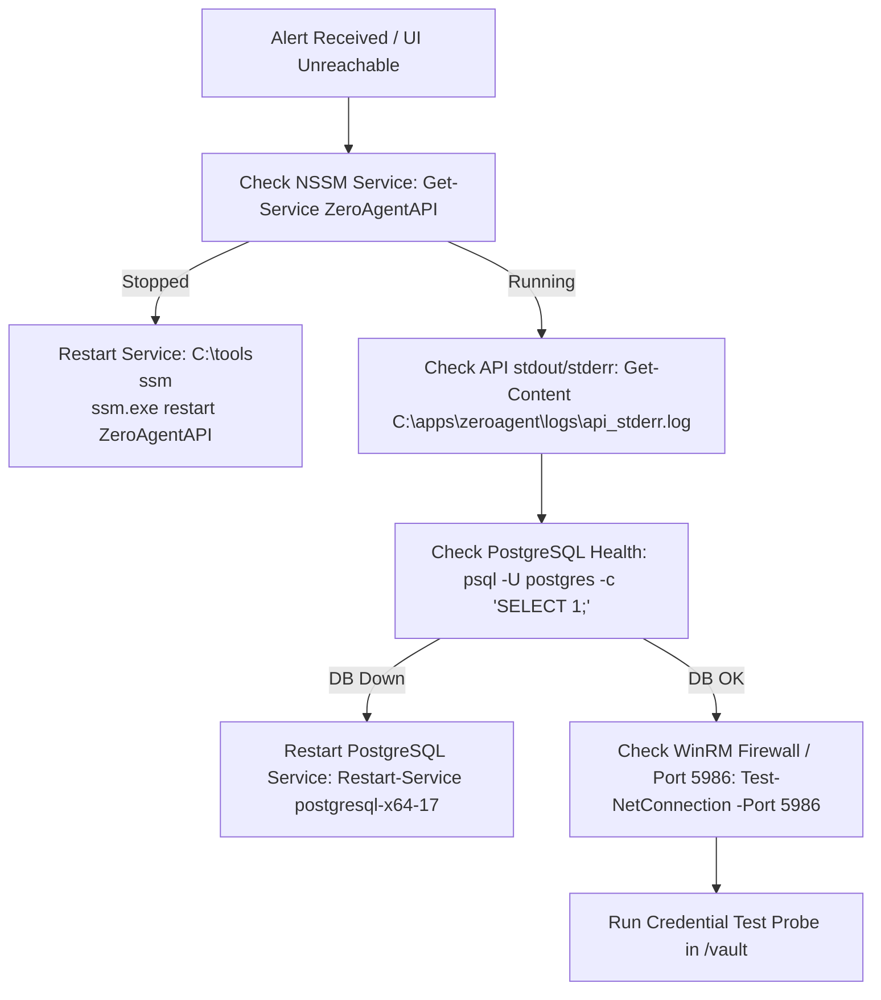

# ZeroAgent-Scan / EndpointGuard EMS — Production Operations Runbook

> **Target Environment**: Windows Server 2016 / 2019 / 2022 (Internal Enterprise Deployment)  
> **Application Root**: `C:\apps\zeroagent`  
> **Database & Storage Volumes**: `D:\postgres\data` | `D:\backups\zeroagent` | `D:\archives\snapshots`  
> **Service Account**: `.\svc_zeroagent` (Least-Privilege)  
> **Primary Contact / On-Call**: SecOps & Infrastructure Engineering  

---

## Quick Reference Navigation
1. [NSSM Service Management & Restarts](#1-nssm-service-management--restarts)
2. [Log File Locations & Troubleshooting](#2-log-file-locations--troubleshooting)
3. [Credential Rotation via Admin Panel / Vault](#3-credential-rotation-via-admin-panel--vault)
4. [Database Backups, Restores & Drill Verification](#4-database-backups-restores--drill-verification)
5. [Alert Delivery Health & Verification](#5-alert-delivery-health--verification)
6. [JSONB Snapshot Retention & Cold-Storage Archival](#6-jsonb-snapshot-retention--cold-storage-archival)
7. [Emergency Incident Checklist](#7-emergency-incident-checklist)

---

## 1. NSSM Service Management & Restarts

ZeroAgent-Scan runs as a Windows Service managed by **NSSM (Non-Sucking Service Manager)** under the local service account `.\svc_zeroagent`. The service is configured to automatically restart upon failure with a 5000ms delay.

### Service Identifiers
- **Service Name**: `ZeroAgentAPI`
- **Display Name**: `ZeroAgent API Service`
- **Binary Location**: `C:\apps\zeroagent\api\server.exe`
- **Working Directory**: `C:\apps\zeroagent\api`
- **NSSM Executable**: `C:\tools\nssm\nssm.exe`
- **Reverse Proxy**: IIS (Application Request Routing + URL Rewrite) listening on ports `443` and `80`

---

### Restarting the API Service

Open an elevated Administrator PowerShell session:

```powershell
# Option A: Restart via NSSM CLI
C:\tools\nssm\nssm.exe restart ZeroAgentAPI

# Option B: Restart via PowerShell Service Cmdlets
Restart-Service -Name ZeroAgentAPI -Force

# Verify Service is Running
Get-Service -Name ZeroAgentAPI
```

### Checking Service Status & Process Details
```powershell
# Query NSSM status
C:\tools\nssm\nssm.exe status ZeroAgentAPI

# Inspect running process & memory consumption
Get-Process -Name server, node, postgres -ErrorAction SilentlyContinue | Select-Object Name, Id, WS, CPU
```

### Starting / Stopping the Service
```powershell
# Stop Service
C:\tools\nssm\nssm.exe stop ZeroAgentAPI
# or: Stop-Service -Name ZeroAgentAPI

# Start Service
C:\tools\nssm\nssm.exe start ZeroAgentAPI
# or: Start-Service -Name ZeroAgentAPI
```

### Restarting IIS Web Server (Reverse Proxy)
If the web UI at `https://<server-ip>/` is unreachable but the API process is running:
```powershell
iisreset /restart
```

---

## 2. Log File Locations & Troubleshooting

All system logs are written to dedicated directories on the local machine.

### Log File Directory Table

| Log File / Path | Purpose & Content | Typical Inspection Command |
| :--- | :--- | :--- |
| `C:\apps\zeroagent\logs\api_stdout.log` | API console output, incoming HTTP requests, scan progress | `Get-Content C:\apps\zeroagent\logs\api_stdout.log -Tail 100 -Wait` |
| `C:\apps\zeroagent\logs\api_stderr.log` | Uncaught panics, fatal engine errors, stderr streams | `Get-Content C:\apps\zeroagent\logs\api_stderr.log -Tail 100` |
| `C:\apps\zeroagent\logs\install_*.log` | Initial server provisioning and prereq setup audit | `Get-ChildItem C:\apps\zeroagent\logs\install_*.log \| Sort-Object LastWriteTime -Descending \| Select-Object -First 1` |
| `C:\apps\zeroagent\logs\update_*.log` | Binary update, database migration, and rollback logs | `Get-ChildItem C:\apps\zeroagent\logs\update_*.log \| Sort-Object LastWriteTime -Descending \| Select-Object -First 1` |
| `C:\apps\zeroagent\logs\backup_*.log` | Nightly PostgreSQL database dump logs | `Get-ChildItem C:\apps\zeroagent\logs\backup_*.log \| Sort-Object LastWriteTime -Descending \| Select-Object -First 1` |
| `C:\apps\zeroagent\logs\restore_drill_*.log` | Quarterly restore drill execution logs | `Get-ChildItem C:\apps\zeroagent\logs\restore_drill_*.log \| Sort-Object LastWriteTime -Descending \| Select-Object -First 1` |
| `C:\apps\zeroagent\logs\snapshot_archive_*.log` | Nightly JSONB cold storage compression & archival logs | `Get-ChildItem C:\apps\zeroagent\logs\snapshot_archive_*.log \| Sort-Object LastWriteTime -Descending \| Select-Object -First 1` |
| `C:\apps\zeroagent\logs\configure_tls_*.log` | Windows SCHANNEL TLS 1.2+ registry and cert binding logs | `Get-Content C:\apps\zeroagent\logs\configure_tls_*.log -Tail 50` |
| `D:\backups\zeroagent\restore_drill_history.json` | Permanent machine-readable drill history paper trail | `Get-Content D:\backups\zeroagent\restore_drill_history.json \| ConvertFrom-Json` |
| `D:\backups\zeroagent\snapshot_retention_history.json`| Permanent audit record of snapshot retention executions | `Get-Content D:\backups\zeroagent\snapshot_retention_history.json \| ConvertFrom-Json` |
| `D:\postgres\data\log\postgresql-*.log` | PostgreSQL database engine logs and slow queries | `Get-ChildItem D:\postgres\data\log\*.log \| Sort-Object LastWriteTime -Descending \| Select-Object -First 1` |

---

### Live Tail Troubleshooting Commands

```powershell
# 1. Live stream API logs in real-time:
Get-Content -Path "C:\apps\zeroagent\logs\api_stdout.log" -Tail 50 -Wait

# 2. Check for recent errors in API stderr:
Get-Content -Path "C:\apps\zeroagent\logs\api_stderr.log" -Tail 100

# 3. View Windows Application Event Logs for ZeroAgentAPI:
Get-WinEvent -FilterHashtable @{LogName='Application'; ProviderName='ZeroAgentAPI'} -MaxEvents 20 | Format-Table TimeCreated, Id, Message -Wrap
```

---

## 3. Credential Rotation via Admin Panel / Vault

ZeroAgent-Scan utilizes **AES-256-GCM** encryption with **HKDF-SHA256** key derivation to store scan credentials. Scan credentials never touch disk or the database in plaintext and are referenced solely by opaque identifiers (`sec_ref_...`).

> **Security Requirement**: Credential rotation requires the **Admin** role and triggers a **Step-Up Authentication** prompt.

---

### Method A: Rotation via Web Console (Recommended)

1. Open the ZeroAgent dashboard in your browser: `https://<server-ip-or-domain>/vault`
2. Authenticate with an account having the **Admin** role.
3. Locate the target credential profile under **Registered Opaque Scan Credentials** (e.g. `svc_endpointguard_winrm`).
4. **Step 1 — Pre-Rotation Reachability Probe**:
   - Click the **"Test Auth Probe"** button next to the credential.
   - Enter a known online pilot host IP (e.g., `10.100.1.42`) and click **"Run Test Probe"**.
   - Confirm successful authentication (`HTTP 200 / Kerberos / NTLM OK`).
5. **Step 2 — Execute Credential Rotation**:
   - Click the **"Rotate Credential"** action.
   - When prompted for Step-Up Re-Authentication, enter your password / MFA token.
   - Enter the **New Secret Value / Password** for the Active Directory service account or local admin account.
   - Enter an **Operator Justification Note** (e.g., `Scheduled 90-day Active Directory service account password rotation - Ticket #SEC-8821`).
   - Click **"Confirm & Rotate Secret"**.
6. **Step 3 — Post-Rotation Verification**:
   - The secret is immediately re-encrypted with a fresh IV/nonce and memory zeroized.
   - Click **"Test Auth Probe"** again on the test target to confirm the new password authenticates cleanly before scheduled batch scans fire.

---

### Method B: Rotation via REST API (Automation / Scripting)

```powershell
# Target API Base URL
$ApiBase = "http://127.0.0.1:8080/api/v1"
$TenantID = "tenant-default-01"
$CredID = "cred-01-domain-winrm" # Replace with actual opaque ID

# 1. Obtain Step-Up Token (Requires Admin credentials)
$AuthBody = @{
    username = "admin@endpointguard.local"
    password = "YourAdminPasswordHere"
    step_up_reason = "Service account rotation"
} | ConvertTo-Json

$AuthRes = Invoke-RestMethod -Uri "$ApiBase/auth/step-up" -Method POST -Body $AuthBody -ContentType "application/json"
$StepUpToken = $AuthRes.step_up_token

# 2. Execute Rotation
$RotateBody = @{
    new_secret_value = "P@ssw0rd2026!EnterpriseSecure"
} | ConvertTo-Json

$RotateRes = Invoke-RestMethod -Uri "$ApiBase/vault/credentials/$CredID/rotate" `
    -Method POST `
    -Headers @{
        "X-Tenant-ID" = $TenantID
        "Authorization" = "Bearer $StepUpToken"
    } `
    -Body $RotateBody `
    -ContentType "application/json"

Write-Host "Rotation Status: $($RotateRes.status) at $($RotateRes.rotated_at)"

# 3. Test Probe with new secret
$TestBody = @{
    target_ip = "10.100.1.42"
    protocol  = "https"
    port      = 5986
} | ConvertTo-Json

$TestRes = Invoke-RestMethod -Uri "$ApiBase/vault/credentials/$CredID/test" `
    -Method POST `
    -Headers @{
        "X-Tenant-ID" = $TenantID
        "Authorization" = "Bearer $StepUpToken"
    } `
    -Body $TestBody `
    -ContentType "application/json"

Write-Host "Probe Result: $($TestRes.status) (Latency: $($TestRes.latency_ms)ms)"
```

---

## 4. Database Backups, Restores & Drill Verification

Database backups are created via `pg_dump` in compressed custom format (`.dump`) and paired with SHA-256 integrity checksum files (`.sha256`).

### Directory Locations
- **Backups Volume**: `D:\backups\zeroagent\`
- **PostgreSQL Binaries**: `C:\Program Files\PostgreSQL\17\bin\` (or `15\bin`)
- **Database Name**: `zeroagent_db`
- **Database Owner**: `zeroagent_app`

---

### Action A: Run a Manual Backup
Execute this before applying system updates or making major configuration changes:

```powershell
Set-Location "C:\apps\zeroagent\deploy"

# 1. Take a standalone manual backup:
.\backup-db.ps1 -ConfigPath "C:\apps\zeroagent\deploy\deploy.config.json"

# 2. Or take a backup and IMMEDIATELY run an automated scratch restore drill to verify integrity:
.\backup-db.ps1 -ConfigPath "C:\apps\zeroagent\deploy\deploy.config.json" -RunDrill
```

**Expected Result**:
- Creates `D:\backups\zeroagent\zeroagent_db_backup_YYYYMMDD_HHMMSS.dump`
- Creates `D:\backups\zeroagent\zeroagent_db_backup_YYYYMMDD_HHMMSS.dump.sha256`
- Automatically prunes backups exceeding the retention policy (keeps 30 daily + 12 weekly).

---

### Action B: Run a Non-Destructive Restore Drill (Safe on Production)
This script restores the latest backup into a **temporary throwaway database** (`zeroagent_restore_scratch`), runs integrity assertions across all critical tables, logs the result to an audit log file, and dispatches webhook notifications without affecting production operations.

```powershell
Set-Location "C:\apps\zeroagent\deploy"

# Execute Restore Drill on latest backup:
.\restore-drill.ps1 -ConfigPath "C:\apps\zeroagent\deploy\deploy.config.json"
```

**What the Drill Verifies**:
1. SHA-256 cryptographic checksum matching `.sha256` manifest.
2. `pg_restore` schema and row loading into `zeroagent_restore_scratch`.
3. Table existence (`public.endpoints`, `hardware_inventory`, `security_posture`, `host_snapshots`, `security_audit_logs`).
4. Non-null JSONB snapshot structure validation.
5. Writes paper trail to `D:\backups\zeroagent\restore_drill_history.json`.
6. Drops `zeroagent_restore_scratch` automatically (or pass `-KeepScratch` for forensic analysis).

---

### Action C: Full Disaster Recovery Restore (Production Restoration)

> ⚠️ **CRITICAL WARNING**: This procedure replaces the live `zeroagent_db` database. Use only during an actual disaster recovery event or database corruption.

```powershell
# Step 1: Stop the application API service to release active database locks
C:\tools\nssm\nssm.exe stop ZeroAgentAPI

# Step 2: Set PostgreSQL environment variables
$env:PGHOST = "127.0.0.1"
$env:PGPORT = "5432"
$env:PGUSER = "postgres"
$PgBin = "C:\Program Files\PostgreSQL\17\bin"
if (-not (Test-Path $PgBin)) { $PgBin = "C:\Program Files\PostgreSQL\15\bin" }

# Step 3: Select Backup File to Restore
$BackupFile = "D:\backups\zeroagent\zeroagent_db_backup_YYYYMMDD_HHMMSS.dump" # Specify target file

# Step 4: Verify SHA-256 Checksum prior to restoring
$ExpectedHash = (Get-Content "$BackupFile.sha256").Trim()
$ActualHash = (Get-FileHash -Path $BackupFile -Algorithm SHA256).Hash.Trim()
if ($ExpectedHash -ne $ActualHash) {
    throw "BACKUP CHECKSUM CORRUPTED! Aborting restore."
}

# Step 5: Terminate existing DB connections & recreate fresh database
& "$PgBin\psql.exe" -d postgres -c "SELECT pg_terminate_backend(pid) FROM pg_stat_activity WHERE datname='zeroagent_db' AND pid <> pg_backend_pid();"
& "$PgBin\psql.exe" -d postgres -c "DROP DATABASE IF EXISTS zeroagent_db;"
& "$PgBin\psql.exe" -d postgres -c "CREATE DATABASE zeroagent_db WITH OWNER zeroagent_app;"

# Step 6: Execute pg_restore
& "$PgBin\pg_restore.exe" -d zeroagent_db -v --no-owner --no-privileges $BackupFile

# Step 7: Restart the API service
C:\tools\nssm\nssm.exe start ZeroAgentAPI

# Step 8: Verify system health
Start-Sleep -Seconds 5
Invoke-RestMethod -Uri "http://127.0.0.1:8080/api/v1/health"
```

---

## 5. Alert Delivery Health & Verification

ZeroAgent-Scan includes an active verification system to confirm that fleet failure alerts reach human on-call engineers (via Slack, Teams, PagerDuty, or Email Webhooks) rather than silently failing.

### Visual Health Status Indicator
- Open `https://<server-ip-or-domain>/admin`
- **Banner at top of Admin page**:
  - 🟢 **Verified**: `Alerting Delivery Pipeline Verified [DELIVERED]` — Displays date of last successful test and operator name.
  - 🟡 **Lapsed**: `Alerting Pipeline Verification Lapsed (90+ Days / Untested) [LAPSED]` — Displayed if no test alert has succeeded in >90 days.

---

### Sending a Synthetic Test Alert

#### Via Dashboard UI:
1. Navigate to `https://<server-ip-or-domain>/admin`
2. Scroll to the **Human Alert Delivery Verification** card.
3. Verify or enter your target webhook URL (e.g. `https://hooks.slack.com/services/...`).
4. Enter an operator note (e.g. `Monthly On-Call Notification Check`).
5. Click **"Send Test Alert"**.
6. The system dispatches a test payload marked with:
   `[SYNTHETIC TEST ALERT - NOT A REAL INCIDENT]`
7. Verify that the message arrived in your notification channel and inspect the delivery receipt displayed on screen (HTTP 200 and latency in ms).

#### Via PowerShell / CLI:
```powershell
$Headers = @{
    "X-Tenant-ID" = "tenant-default-01"
}

$Payload = @{
    webhook_url = "https://hooks.slack.com/services/T0000/B000/XXXXX"
    test_reason = "Manual verification of alert dispatch pipeline"
} | ConvertTo-Json

$Response = Invoke-RestMethod -Uri "http://127.0.0.1:8080/api/v1/admin/alerts/test" `
    -Method POST `
    -Headers $Headers `
    -Body $Payload `
    -ContentType "application/json"

Write-Host "Status   : $($Response.status)"
Write-Host "Receipt  : $($Response.verification_receipt)"
Write-Host "Latency  : $($Response.duration_ms) ms"
```

#### Query Current Alert Health Status:
```powershell
$Health = Invoke-RestMethod -Uri "http://127.0.0.1:8080/api/v1/admin/alerts/health" -Headers @{ "X-Tenant-ID" = "tenant-default-01" }
$Health | Format-List
```

---

## 6. JSONB Snapshot Retention & Cold-Storage Archival

To prevent database bloat across 400 daily scanned endpoints, older `host_snapshots` raw telemetry is archived to compressed gzip files (`.json.gz`) on cold storage (`D:\archives\snapshots\YYYY-MM\`).

> **Compliance Guarantee**: Calculated `drift_events`, CVE findings in `vulnerabilities`, and `compliance_evaluations` are stored independently and **never deleted**. Only the heavy raw introspection payload is cleared from PostgreSQL.

### Scheduled Nightly Task
- **Task Name**: `ZeroAgent-SnapshotRetention`
- **Schedule**: Nightly at **03:30 AM** (Low CPU priority)
- **Script**: `C:\apps\zeroagent\deploy\archive-snapshots.ps1`

---

### Executing Snapshot Retention Manually

```powershell
Set-Location "C:\apps\zeroagent\deploy"

# 1. Run a Safe Dry-Run (Preview space savings without altering database):
.\archive-snapshots.ps1 -DryRun

# 2. Execute Live Archival (Archives snapshots older than 90 days to D:\archives\snapshots):
.\archive-snapshots.ps1 -RetentionDays 90 -Strategy archive -ColdStoragePath "D:\archives\snapshots"

# 3. Execute Weekly Downsampling (Retains 1 golden weekly snapshot per host, prunes intermediate daily snapshots):
.\archive-snapshots.ps1 -RetentionDays 90 -Strategy downsample
```

---

## 7. Emergency Incident Checklist

If scans are failing or the dashboard is unreachable, follow this sequence:



### Incident Verification Step List
- [ ] **Step 1: Check NSSM Service**: `C:\tools\nssm\nssm.exe status ZeroAgentAPI`
- [ ] **Step 2: Check Postgres Engine**: `Get-Service -Name "postgresql*"`
- [ ] **Step 3: Check Disk Space**: Ensure `C:\` and `D:\` partitions have >15% free space (`Get-PSDrive -PSProvider FileSystem`).
- [ ] **Step 4: Check Outbound WinRM / Firewall**:
  ```powershell
  Test-NetConnection -ComputerName 10.100.1.42 -Port 5986
  ```
- [ ] **Step 5: Verify Vault Auth Probe**: Run test probe in `/vault` against a test endpoint.
- [ ] **Step 6: Check Alert Health**: Verify alert delivery in `/admin` with "Send Test Alert".

---

## 8. Production Readiness & Pre-Go-Live Audit

Before cutting over traffic or scanning real endpoints, perform the comprehensive **Production Readiness Audit** to guarantee that no demo data, weak development keys, or mock flags exist in the environment:

### Option A: Via Command Line (Automated CI/CD Gate)
```powershell
# Run one-time production readiness audit (exits with code 0 on PASS, 1 on FAIL)
C:\apps\zeroagent\api\server.exe --readiness-check
```

### Option B: Via Web Dashboard GUI
1. Navigate to [https://zeroagent.corp.local/admin/readiness](https://zeroagent.corp.local/admin/readiness)
2. Review the 6 security pillars:
   - **Demo & Seed Data Elimination**: Asserts zero `DEMO-*` hosts or RFC 5737 IPs in database.
   - **Vault Master Key Entropy**: Asserts non-default, high-entropy 256-bit AES-GCM key.
   - **Break-Glass Credential Rotation**: Asserts emergency password has been rotated.
   - **Simulation Flags Disabled**: Asserts `MOCK_SCAN_MODE=false`.
   - **Audit Logging Stream**: Asserts immutable trace logging pipeline is active.
   - **Collector Gateway Topology**: Asserts mTLS gateways are operational.
3. Confirm overall verdict displays: 🟢 **GO-LIVE APPROVED: PRODUCTION READY**.

