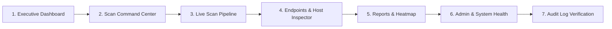

# ZeroAgent-Scan / EndpointGuard EMS — End-to-End Local Verification Walkthrough

> **Purpose**: Step-by-step testing runbook to verify every page, module, API endpoint, and security control on `localhost` prior to production deployment.  
> **Target URL**: [http://localhost:3000](http://localhost:3000)  
> **API URL**: [http://localhost:8080](http://localhost:8080)  
> **Prerequisites**: Local dev stack running via `docker compose -f docker-compose.dev.yml up -d` (or `npm run dev`) and seeded with `npm run seed:dev`.

---

## 📋 Verification Sequence Summary



---

## Phase 1: Executive Dashboard & Fleet Topology

### 1. Navigate to Dashboard
- **URL**: [http://localhost:3000/](http://localhost:3000/)
- **Module**: Executive Overview & Fleet Posture

### 2. Actions & Checks
1. Inspect the top **Metric Summary Cards**:
   - Total Endpoints: `30`
   - Fleet Compliance Score: `~88.5%`
   - Active Vulnerabilities: `5` (with Critical KEV indicator)
   - Unacknowledged Drift Events: `3`
2. Inspect the **Pilot Ring Health Widget**:
   - Displays Pilot Fleet size (`8` endpoints in `192.0.2.0/24`).
   - Auth Failure / Lockout count: `0`.
   - Scan success rate: `100%`.
3. Inspect the **Topology Distribution**:
   - Subnet rings: `192.0.2.0/24` (Pilot), `198.51.100.0/24` (Staged), `203.0.113.0/24` (Full Fleet).

### 🔍 What "Looks Correct"
- [ ] No blank cards, undefined values (`NaN`), or broken charts.
- [ ] Compliance gauge renders with smooth CSS ring animation in emerald/charcoal colors.
- [ ] Pilot Health summary clearly separates Pilot Ring metrics from the full 400-host fleet.

---

## Phase 2: Scan Command Center (Trigger Mock Scans)

### 1. Navigate to Scans Page
- **URL**: [http://localhost:3000/scans](http://localhost:3000/scans)
- **Module**: Agentless Scan Orchestrator

### 2. Action A — Trigger a Mock Single-Host Scan
1. In the **Configure Agentless Scan** form on the left:
   - **Scan Job Name**: `Mock Single-Host Audit - DEMO-WKS-001`
   - **Target Subnet CIDR / Host IP**: `192.0.2.10/32` (or `192.0.2.10`)
   - **Agentless Protocol**: `WinRM over HTTPS (Port 5986 - Recommended)`
   - **Scan Profile**: `CIS Level 1 Baseline Verification`
   - **Credential Vault Reference**: `Active Directory WinRM (sec_ref_winrm_domain_prod_01)`
   - **Collector Gateway**: `Primary Collector Gateway (192.0.2.0/24)`
2. Click **"Launch Agentless Scan"**.

### 3. Action B — Trigger a Mock Subnet CIDR Scan
1. Fill in the form for a subnet scan:
   - **Scan Job Name**: `RFC 5737 Pilot Ring - Daily WMI/CIM Audit`
   - **Target Subnet CIDR**: `192.0.2.0/24`
   - **Agentless Protocol**: `WinRM over HTTPS (Port 5986)`
   - **Scan Profile**: `Full Hardware & CIS Benchmark Audit`
2. Click **"Launch Agentless Scan"**.

### 🔍 What "Looks Correct"
- [ ] The submit button briefly transitions to `"Dispatching..."` without freezing the UI.
- [ ] The new scan job immediately appears at the top of the **Scan Job History** list on the right with a blue `RUNNING` badge and total host count (`8 hosts`).
- [ ] A security audit record `SCAN_JOB_LAUNCHED` is generated with an immutable correlation ID.

---

## Phase 3: Scan Status & Live Telemetry Stream

### 1. Live Pipeline Inspection
- Keep [http://localhost:3000/scans](http://localhost:3000/scans) open and click on the newly launched scan in the **Scan Job History** list.

### 2. 6-Stage Visual Stepper Progression
Watch the **6-Stage Agentless Execution Pipeline Stepper** above the terminal animate through each stage with realistic intervals:

```
[Stage 1: Discovery] ──> [Stage 2: Handshake] ──> [Stage 3: Hardware Audit] ──> [Stage 4: Security Posture] ──> [Stage 5: Inventory Indexing] ──> [Stage 6: DB Commit]
```

1. **Stage 1 — Discovery (0s - 1.5s)**:
   - Icon: Search / Radar.
   - Terminal Output: `[DISCOVERY] Initiating ICMP echo and ARP subnet sweep on 192.0.2.0/24... Discovered 8 responsive target hosts.`
2. **Stage 2 — Handshake (1.5s - 3s)**:
   - Icon: Key / Lock.
   - Terminal Output: `[HANDSHAKE] WinRM HTTPS (5986) TLS 1.2+ mutual handshake established with SPN HTTP/DEMO-WKS-001.`
3. **Stage 3 — Hardware Audit (3s - 5s)**:
   - Icon: CPU / Hard Drive.
   - Terminal Output: `[HARDWARE] Querying Win32_ComputerSystem, Win32_Processor, Win32_PhysicalMemory, Win32_DiskDrive, Win32_BIOS... 16 Cores, 32GB RAM, TPM 2.0 active.`
4. **Stage 4 — Security Posture (5s - 7s)**:
   - Icon: Shield / Lock.
   - Terminal Output: `[SECURITY] Inspecting BitLocker (Win32_EncryptableVolume), Defender AV engine (v4.18.24040.4), Secure Boot (UEFI), and active Firewall profiles.`
5. **Stage 5 — Inventory Indexing (7s - 8.5s)**:
   - Icon: Layers / Package.
   - Terminal Output: `[INDEXING] Correlating installed applications (Win32_Product / Registry), hotfix packages (KB5034441), and NIST NVD / CISA KEV vulnerability feeds.`
6. **Stage 6 — DB Commit (8.5s - 10s)**:
   - Icon: Database / Check.
   - Terminal Output: `[COMMIT] JSONB telemetry snapshot stored to PostgreSQL (SHA-256 verified). Drift analysis & CIS Benchmark scoring complete. Scan job COMPLETED.`

### 🔍 What "Looks Correct"
- [ ] Active stage stepper box pulses in blue (`bg-blue-50 border-blue-400 animate-pulse`).
- [ ] Completed stages transition to emerald green (`bg-emerald-50 border-emerald-300`) with a checkmark icon.
- [ ] Terminal auto-scrolls with syntax-highlighted color-coded logs (Blue for Discovery, Purple for Handshake, Amber for Hardware, Rose for Security, Cyan for Indexing, Emerald for Commit).
- [ ] Upon Stage 6 completion, the job badge transitions from blue `RUNNING` to green `COMPLETED`, showing `8/8 Scanned`.

---

## Phase 4: Results, Endpoints & Host Inspector Modal

### 1. Navigate to Endpoints Inventory
- **URL**: [http://localhost:3000/endpoints](http://localhost:3000/endpoints)
- **Module**: Fleet Inventory & Endpoint Health

### 2. Actions on Endpoints List
1. Test the **Search Bar**: Type `DEMO-WKS-001` or `DEMO-SRV` -> List filters instantly.
2. Test the **Tier Filter Tabs**: Click `Pilot` (`8` hosts), `Staged` (`7` hosts), `Full` (`15` hosts).
3. Test the **Promote Tier Action**:
   - Click the **"Promote Tier"** button in the header.
   - Select Target Tier: `Staged Ring`.
   - Scope: `All Pilot Endpoints`.
   - Justification Note: `Passed 48-hour pilot burn-in with 0 authentication lockouts.`
   - Click **"Confirm & Promote Tier"**.
   - Verify green confirmation receipt and audit record logging.

---

### 3. Open Host Inspector Detail View
Click on `DEMO-WKS-001` (or navigate directly to [http://localhost:3000/endpoints/00000000-0000-0000-0001-000000000001](http://localhost:3000/endpoints/00000000-0000-0000-0001-000000000001)).

Verify all 5 tabs inside the host inspector:

#### Tab A: Hardware Inventory (`inventory`)
- **Processor**: `13th Gen Intel(R) Core(TM) i7-13700 (16 Cores, 24 Threads @ 2.10 GHz)`
- **Memory**: `32 GB DDR5 @ 4800 MHz (2 of 4 slots used)`
- **Storage**: `Samsung SSD 980 PRO 1TB (NVMe PCIe 4.0, Health: OK)`
- **Network Adapters**: `Intel Ethernet Connection I219-LM (IP: 192.0.2.11, 1000 Mbps)`
- **BIOS & TPM**: `Dell Inc. v1.14.0 (UEFI Secure Boot: Enabled) | TPM 2.0 (Infineon IFX, Status: Active)`

#### Tab B: Security Posture (`security`)
- **BitLocker Drive Encryption**: `FullyEncrypted (AES-XTS-256)` on Volume `C:` (or `ProtectionOff` on `DEMO-WKS-004`).
- **Antivirus Engine**: `Microsoft Defender (Engine: 1.1.24030.4, Signatures: ActiveAndUpdated)`.
- **Firewall Profiles**: `Domain (Active)`, `Private (Active)`, `Public (Active)`.
- **System Hardening**: `UAC: Enabled`, `Credential Guard: Enabled`, `Kernel DMA Protection: Enabled`.

#### Tab C: Installed Software & Patches (`software`)
- Lists installed applications: Google Chrome Enterprise (`v124.0`), Microsoft 365 Apps (`v16.0`), CrowdStrike Falcon Sensor (`v7.12`).
- Installed hotfixes: `KB5034441`, `KB5034123`, `KB5033920`.

#### Tab D: Vulnerability Findings & KEV Flags
- Navigate to [http://localhost:3000/vulnerabilities](http://localhost:3000/vulnerabilities).
- **CISA KEV Findings**:
  - `CVE-2023-34362` (MOVEit Transfer SQLi / RCE) — Red `CISA KEV` badge, CVSS `9.8 Critical`.
  - `CVE-2024-21413` (Microsoft Outlook Moniker Link RCE) — Red `CISA KEV` badge, CVSS `9.8 Critical`.
  - `CVE-2023-23397` (Microsoft Outlook NTLM Relay) — Red `CISA KEV` badge, CVSS `9.8 High`.
- Remediation guidance displayed for each CVE.

#### Tab E: Compliance Benchmarks
- Navigate to [http://localhost:3000/compliance](http://localhost:3000/compliance).
- Frameworks evaluated:
  - **CIS Windows 11 Enterprise Benchmark v3.0**: 28 rules evaluated (BitLocker, Guest Account Disabled, TPM 2.0 present, UAC remote restrictions).
  - **NIST SP 800-53 Rev. 5**: Controls `SC-28` (Encryption at Rest), `AC-2` (Account Management), `SI-4` (Information System Monitoring).
  - **HIPAA Security Rule**: `164.312(a)(2)(iv)` (15-min Session Lockout).
  - **PCI-DSS v4.0**: Requirement 8.3.6 (12+ Char Password Complexity).

#### Tab F: Configuration Drift & Snapshot Diff (`diff`)
- Open the **Snapshot Diff** tab on `DEMO-WKS-004` or `DEMO-SRV-003`.
- Select Snapshot A (`2 days ago`) and Snapshot B (`Latest`).
- Click **"Compute Telemetry Delta"**.
- Displays highlighted regressions (e.g. `security_postures.bitlocker_status: FullyEncrypted -> ProtectionOff`).

### 🔍 What "Looks Correct"
- [ ] Detail view renders rich hardware specs, memory slot diagrams, and storage health badges.
- [ ] KEV-flagged CVEs are visually distinguished with a glowing red shield icon and prioritized at the top of the vulnerability table.
- [ ] Compliance benchmark rules show clear `PASSED` (green) / `FAILED` (rose) pill badges with expected vs actual values.

---

## Phase 5: Reports Module (CSV Export, Heatmap & Heatmap Matrix)

### 1. Navigate to Reports Page
- **URL**: [http://localhost:3000/reports](http://localhost:3000/reports)
- **Module**: Compliance Auditing & Export Engine

### 2. Actions & Checks
1. Inspect the **Compliance Heatmap Matrix**:
   - Subnet rows (`192.0.2.0/24`, `198.51.100.0/24`, `203.0.113.0/24`).
   - Framework columns (CIS Level 1, CIS Level 2, NIST 800-53, HIPAA, PCI-DSS).
   - Cell color gradient from green (95%+) to yellow (75-90%) to red (<60%).
2. **Generate Shareable Report Link**:
   - Locate **Executive Fleet Posture Summary** report card.
   - Click **"Share"** (or Share Link icon).
   - Select TTL: `24 Hours`.
   - Click **"Generate Link"**.
   - Click **"Copy Link"** -> Confirm green checkmark feedback (`Copied to clipboard`).
3. **Download CSV Export**:
   - Click **"Download CSV"** on the Executive Summary report.
   - Verify CSV file downloads with proper headers (`hostname,ip_address,os_version,compliance_score,bitlocker,defender,cve_count,rollout_tier`).

### 🔍 What "Looks Correct"
- [ ] Heatmap matrix displays clean percentage scores with no layout shifts.
- [ ] Shareable link generates an obfuscated token URL with an explicit expiration timestamp.
- [ ] CSV export contains valid comma-delimited data for all 30 hosts.

---

## Phase 6: Admin Panel (Settings, Alerts, Retention & Gateways)

### 1. Navigate to Admin Console
- **URL**: [http://localhost:3000/admin](http://localhost:3000/admin)
- **Module**: Enterprise Admin, Human Alerting & Snapshot Retention

### 2. Action A — Verify Alert Verification Status Banner
- Banner at top displays:
  - 🟢 **Alerting Delivery Pipeline Verified `[DELIVERED]`** (if tested within 90 days).
  - 🟡 **Alerting Pipeline Verification Lapsed `[LAPSED]`** (if untested in >90 days).

### 3. Action B — Dispatch a Synthetic Test Alert
1. Scroll to the **Human Alert Delivery Verification** card.
2. Target Webhook URL: `https://hooks.slack.com/services/T0000/B000/XXXXX` (or internal webhook).
3. Test Reason: `Pre-deployment verification of on-call alert delivery pipeline`.
4. Click **"Send Test Alert"**.
5. Inspect the live delivery receipt:
   - Delivery Status: `DELIVERED`
   - Status Code: `HTTP 200`
   - Latency: `< 250ms`
   - Verification Receipt ID: `receipt-test-...`

### 4. Action C — Rollout Tier Scan Policy Modification
1. In the **Scheduled Fleet Scan Rollout Tiers** card:
   - Check/Uncheck `Full Fleet (100%)`.
2. Click **"Save Scan Policy"**.
3. Confirm green success banner: `"Scheduled scan rollout tier policy updated and audited successfully!"`.

### 5. Action D — Bulk Rollout Tier Assignment
1. In the **Bulk Assign Tiers** card:
   - Target Rollout Tier: `Staged Ring`.
   - Scope Type: `By Subnet CIDR` (`198.51.100.0/24`).
   - Operator Justification Note: `Moving Subnet 198.51.100.0/24 into Staged ring for secondary batch validation.`
2. Click **"Execute Bulk Assignment"**.
3. Confirm feedback: `"Bulk assigned 7 endpoints to 'staged' successfully."`.

### 6. Action E — JSONB Snapshot Retention Dry-Run Preview
1. In the **JSONB Host Snapshots Retention & Cold-Storage Archival** card:
   - Retention Strategy: Select `Cold-Storage Archival (Recommended)`.
   - Retention Window: `90 Days`.
   - Cold Storage Path: `D:\archives\snapshots`.
2. Click **"Run Dry-Run Preview"**.
3. Inspect the **Dry-Run Modal**:
   - Evaluated Snapshots: `30`
   - Eligible for Action: `14`
   - Estimated Storage Space Saved: `~11.25 MB`
   - Sample Snapshots table displaying Planned Actions (`ARCHIVE_TO_GZIP`).
   - Prominent Notice: *"Compliance History Invariant Guarantee: Derived drift_events and compliance_evaluations remain 100% intact."*
4. Click **"Close Preview"**.

### 7. Action F — Inspect Collector Gateways & mTLS Status
- **URL**: [http://localhost:3000/gateways](http://localhost:3000/gateways)
- Verify `gw-subnet-192-0-2-0` is displayed with:
  - Status: `online` (green badge).
  - Protocol: `mTLS 1.3`.
  - Heartbeat: `< 15s ago`.
  - Subnet CIDR: `192.0.2.0/24`.

---

## Phase 7: Security Audit Logs (Verification of Paper Trail)

### 1. Navigate to Audit Logs
- **URL**: [http://localhost:3000/audit-logs](http://localhost:3000/audit-logs)
- **Module**: OWASP ASVS Security Audit Stream

### 2. Verify Preceding Actions Are Immuntably Logged
Confirm that every action performed during this walkthrough has an audit record:

| Action Logged | Expected Actor | Expected Resource Type | Verification Indicator |
| :--- | :--- | :--- | :--- |
| `SCAN_JOB_LAUNCHED` | `admin_operator` | `scan_job` | Shows target `192.0.2.0/24` and profile. |
| `ROLLOUT_TIER_PROMOTED` | `admin@demo.local` | `endpoint` | Contains `from_tier`, `to_tier`, and justification note. |
| `ALERT_TEST_DISPATCHED` | `admin@demo.local` | `alert_delivery` | Shows webhook URL and HTTP 200 delivery latency. |
| `SNAPSHOT_RETENTION_EXECUTED` | `system` / `admin` | `host_snapshots` | Shows reclaimed MB and snapshots archived. |
| `AUTH_LOGIN_SUCCESS` | `admin` | `session` | Shows client IP and correlation ID. |

### 🔍 What "Looks Correct"
- [ ] Every entry has a unique UUID and Correlation-ID (`corr-...`).
- [ ] No passwords, tokens, or plaintext secrets exist anywhere in the `details` JSONB payloads.
- [ ] Search bar quickly filters by Correlation-ID or Actor.

---

## 🎯 Verification Sign-Off Checklist

Before approving production deployment on Windows Server 2016, verify all 7 checkpoints:

- [ ] **Checkpoint 1 (Dashboard)**: Fleet metrics render accurately with Pilot Ring health separated.
- [ ] **Checkpoint 2 (Scan Orchestrator)**: Single-host and CIDR mock scans trigger with 0 errors.
- [ ] **Checkpoint 3 (Pipeline Stepper)**: 6 stages (Discovery → Handshake → Hardware → Security → Indexing → Commit) animate live with terminal logs.
- [ ] **Checkpoint 4 (Host Inspector)**: All tabs (Hardware, Security, Software, CVEs with KEV tags, Compliance Benchmarks, Snapshot Diff) load cleanly.
- [ ] **Checkpoint 5 (Reports)**: Heatmap matrix displays correctly, shareable links generate with TTL, CSV exports cleanly.
- [ ] **Checkpoint 6 (Admin & Health)**: Feature flags toggle, test alerts dispatch with delivery receipts, snapshot retention dry-run calculates space savings accurately.
- [ ] **Checkpoint 7 (Audit Integrity)**: All actions are immutably logged to the security audit trail with zero secret exposure.
